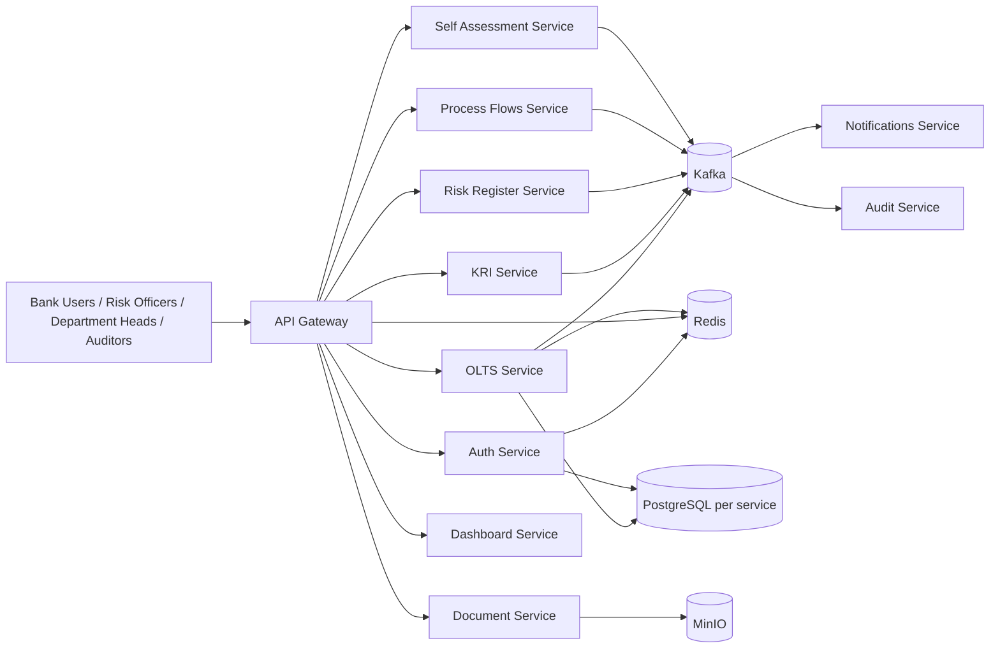

# System Context

```mermaid
flowchart LR
    Users[Bank Users / Risk Officers / Department Heads / Auditors]
    Gateway[API Gateway]
    Auth[Auth Service]
    OLTS[OLTS Service]
    KRI[KRI Service]
    Risk[Risk Register Service]
    PF[Process Flows Service]
    SA[Self Assessment Service]
    Doc[Document Service]
    Audit[Audit Service]
    Notify[Notifications Service]
    Dash[Dashboard Service]
    Kafka[(Kafka)]
    Redis[(Redis)]
    Postgres[(PostgreSQL per service)]
    MinIO[(MinIO)]

    Users --> Gateway
    Gateway --> Auth
    Gateway --> OLTS
    Gateway --> KRI
    Gateway --> Risk
    Gateway --> PF
    Gateway --> SA
    Gateway --> Doc
    Gateway --> Dash
    OLTS --> Kafka
    KRI --> Kafka
    Risk --> Kafka
    PF --> Kafka
    SA --> Kafka
    Kafka --> Notify
    Kafka --> Audit
    Doc --> MinIO
    Auth --> Redis
    Gateway --> Redis
    OLTS --> Redis
    OLTS --> Postgres
    Auth --> Postgres
```
