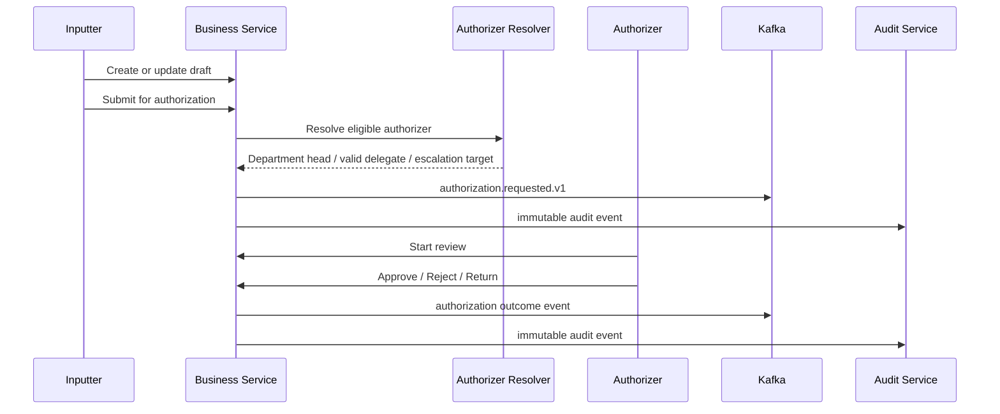

# Maker-Checker Architecture

## Core rules

- The client never assigns the authorizer.
- Authorization is resolved server-side from department ownership, active assignments, delegations, and conflict rules.
- `inputterUserId != authorizerUserId`
- `lastModifiedBy != authorizerUserId`
- Authorized records are immutable; material changes create a new pending version.

## Sequence

